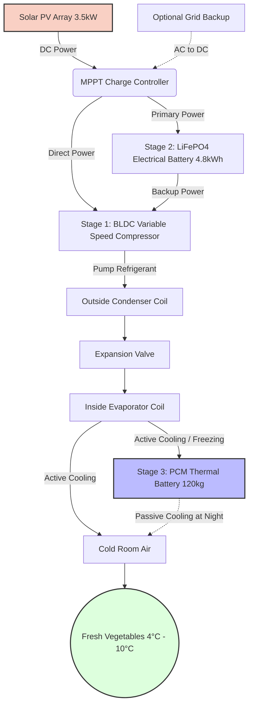
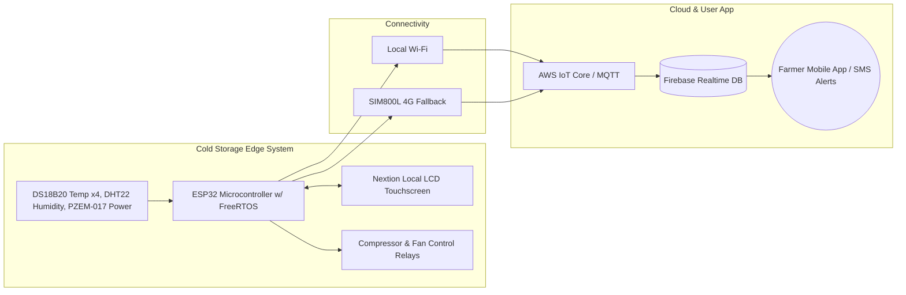
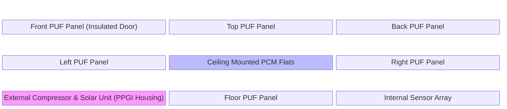

# SIH26005: System Architecture & Visual Designs

This document provides the formal structural and logic designs required to build and pitch the system. These text-based diagrams (Mermaid.js) can be copied directly into presentation software or markdown viewers.

## 1. Power & Cooling Flow Architecture (The 3-Stage Logic)

This diagram illustrates how energy moves from the sun to the vegetables, highlighting our 3-Stage innovation.

## 2. IoT & Cloud Data Architecture

This details how the system satisfies the "Smart Monitoring" requirement of the problem statement.

## 3. Physical Layout & Structural Modularity Design (For NER Terrain)

Because the NER terrain is difficult, the physical design must be "knock-down" and modular.

### Physical Design Rules for Construction:
1. **Knock-Down Assembly:** The 6 PUF panels (walls, floor, roof) use cam-locks. They can be carried by a small pickup truck or even a tractor up a hill and assembled in 2 hours using an Allen key.
2. **Top-Mounted PCM:** The Phase Change Material flats are mounted to the ceiling. Because cold air sinks, as the PCM melts at night, the cold air naturally falls over the vegetables without needing the fan, saving even more battery power.
3. **Rust Prevention:** The external compressor housing is made of Pre-Painted Galvanized Iron (PPGI) to prevent rust from heavy NER monsoons.
